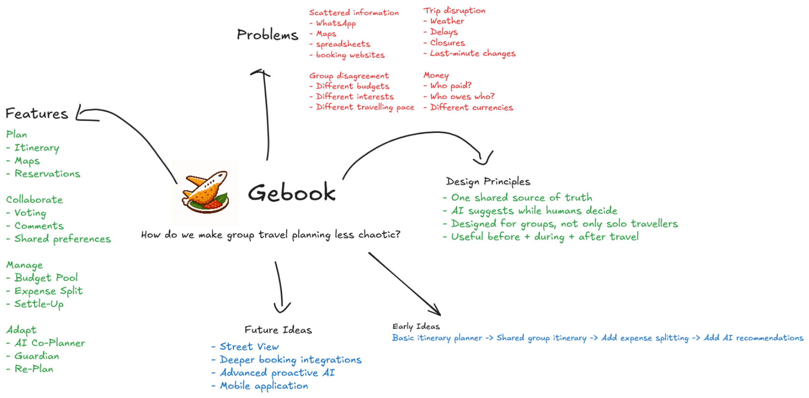
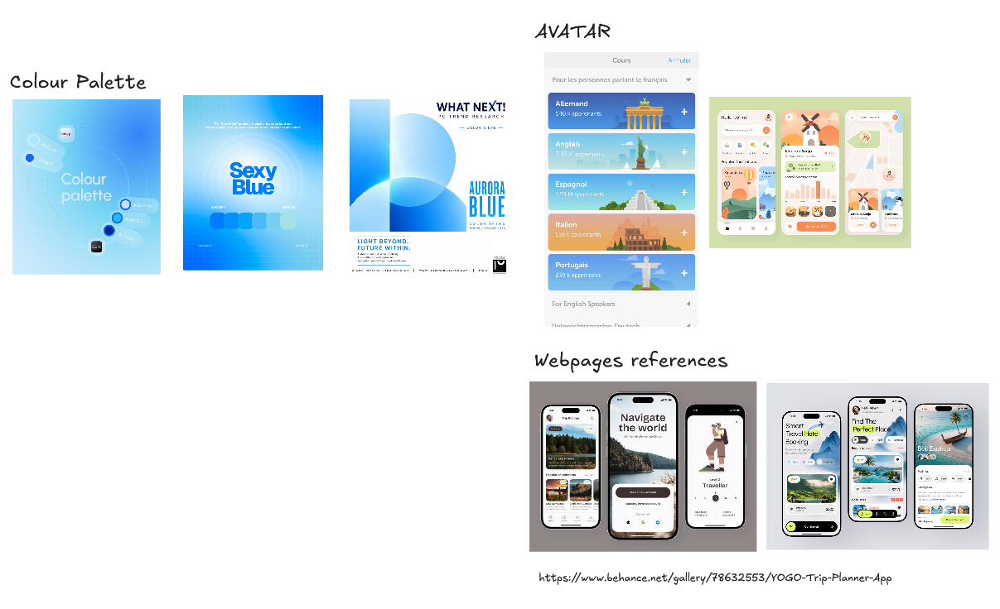
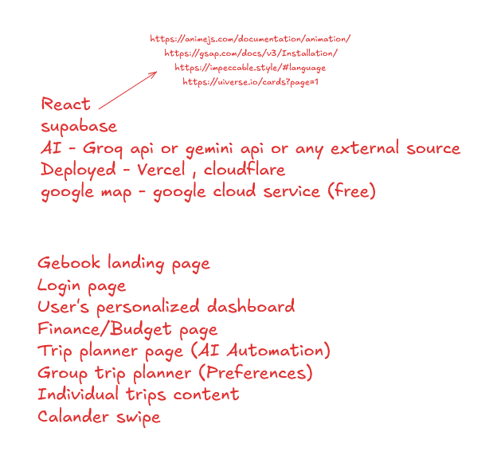
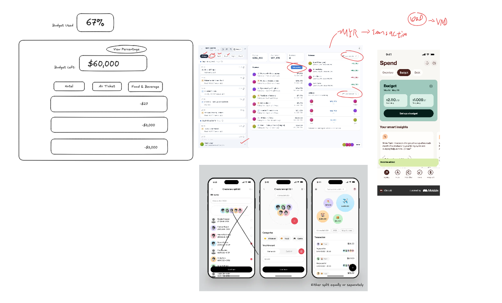
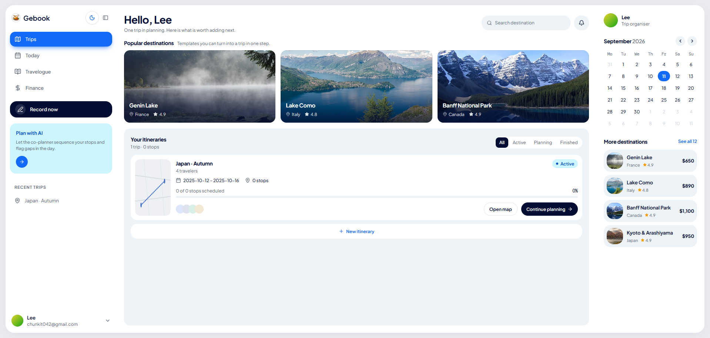
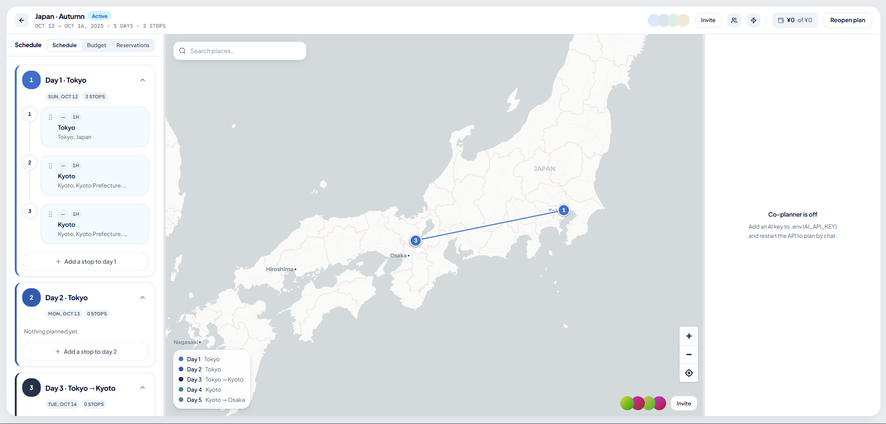
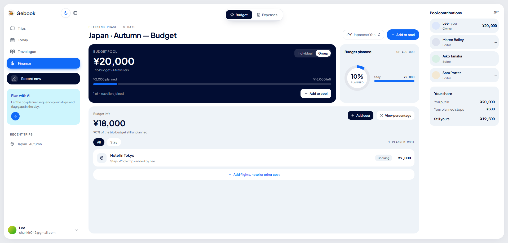
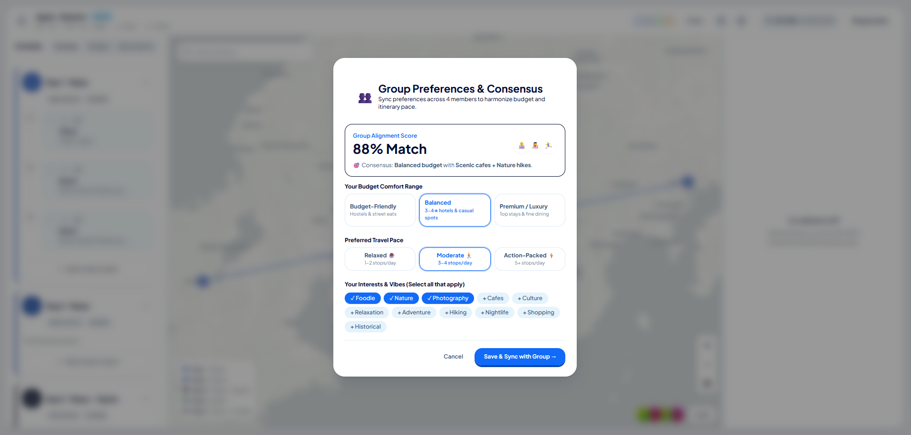
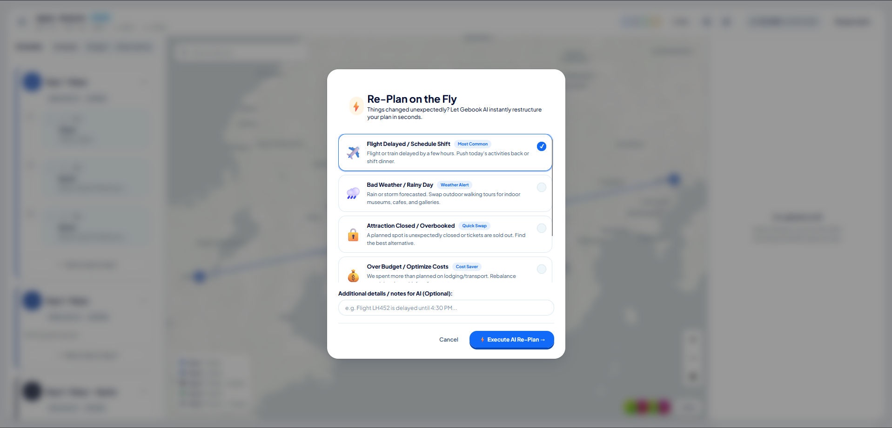
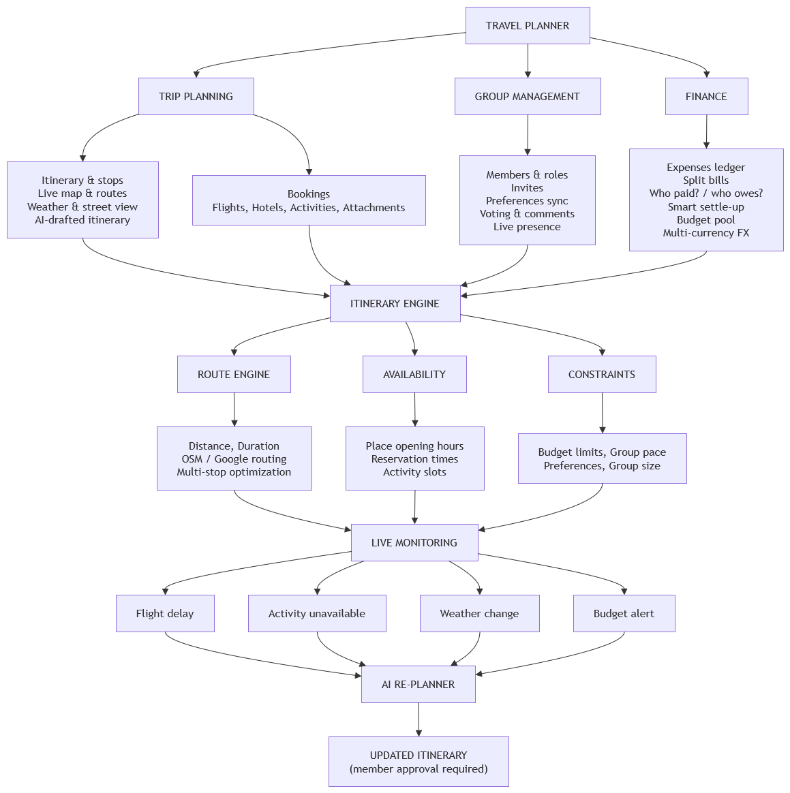

# Gebook by AyamGepuk

**Team:** Tan Lok Qi, Tsang Da Xin, Yap Wai Hong, Lee Chun Kit

**Problem Statement:** Travel Planner

**Video Presentation:** [Unlisted YouTube Link](https://youtu.be/UuVywKLqQs0) 

**Presentation Slides:** [Public Link](https://canva.link/nm6rfnsezmonslo)

---

## 1. Project Overview

### The Problem

Group travel planning is fragmented across too many disconnected tools. Flights, accommodation, activities, maps, reservations and budgets end up spread across WhatsApp threads, spreadsheets, booking sites, and separate map apps, and travellers are left manually stitching it all together themselves.

On top of that:
- **Group coordination is hard** — every traveller in the group has a different budget, different interests, a different pace, and different preferences, and reconciling them is entirely manual.
- **Trips break in real time** — flight delays, bad weather, closed attractions, and overspending can make an existing itinerary unusable with no easy way to adapt it.

This isn't a small problem: APAC travellers view an average of **149 pages** of travel content over **45 days** and spend **298 minutes** consuming travel-related content before booking a single trip (Expedia Group, 2024). Group travel specifically is a growing segment — globally **1 in 5** travellers planned a trip with friends for summer 2025, rising to **33%** among Gen Z travellers (Booking.com, 2025).

**Stakeholders / target users:** Gen Z travellers, students and friend groups, couples, and solo travellers.

**Existing tools fall short:**
- **Wanderlog** and **TripIt** cover itinerary planning, maps, and group planning well, but neither combines that with real expense splitting *and* an adaptive AI in one workspace.
- **Splitwise** solves the money problem well but has no itinerary, maps, or AI planning at all.
- None of them offer group preference alignment, approval-gated AI changes, or proactive risk detection — see [What Makes It Different](#4-what-makes-it-different) below.

### Our Solution

Gebook is one shared workspace for an entire group trip — plan the itinerary, agree on it as a group, manage the shared budget, and adapt when things go wrong, without leaving the app. Members plan flights, activities, reservations, maps, and weather together in real time; the group syncs on preferences and votes on stops instead of arguing over group chat; a shared budget pool and multi-currency expense splitter (with automatic Smart Settle-Up) replaces manual money tracking; and an approval-first AI co-planner researches, suggests, and — only once a member approves — updates the plan, including one-click emergency re-planning when something goes wrong.

**Feature set:**

| Pillar | Features |
| :--- | :--- |
| **Plan** | Itinerary & day-by-day stops, live interactive map & routes, flight/hotel/activity reservations, weather & street view, AI-drafted itineraries |
| **Agree** | Live multi-member collaboration, stop voting, threaded comments, group preferences sync (budget/pace/interests match-alignment) |
| **Manage** | Shared budget pool, multi-currency expense splitting, Smart Settle-Up debt minimization, spending insights |
| **Adapt** | Approval-first AI co-planner, proactive risk detection ("AI Trip Guardian"), one-click emergency re-planning |

---

## 2. Ideation & Process

### 2.1 Ideas We Considered

| Idea | Why it was dropped / kept |
| :--- | :--- |
| Shared group itinerary with a live map (Chosen) | Scattered information (WhatsApp, spreadsheets, booking sites, maps) was the #1 problem identified — kept as the foundation of the product. |
| Expense splitting & Smart Settle-Up (Chosen) | "Who paid? Who owes who?" across different currencies was a top group-travel pain point — kept and grown into a full Finance page. |
| Group preferences sync & voting (Chosen) | Different budgets, interests, and travel pace were named as a core coordination problem — kept as "Group Preferences Sync". |
| Approval-first AI co-planner (Chosen) | Matches our design principle "AI suggests, humans decide" — kept instead of a fully autonomous planner. |
| AI Trip Guardian / emergency re-plan (Chosen) | Trip disruption (delays, weather, closures) was a named top pain point — kept as "Re-Plan on the Fly" plus a passive risk-detection pass. |
| Street View integration | Useful polish, not core to the MVP loop — moved to [Future Enhancements](#future-enhancements) rather than dropped outright. |
| Deeper live booking integrations (flights/hotels) | Out of scope for a 3-week build — moved to Future Enhancements. |
| Native mobile application | The desktop + installable PWA covers the MVP; deferred to Future Enhancements. |
| Fully autonomous re-planning AI | Considered, but intentionally scoped back to stay approval-first rather than changing a trip without a human in the loop. |

### 2.2 Ideation Boards

**Mindmap — problems, features & design principles**



Mapped outward from one question: *"How do we make group travel planning less chaotic?"* Branches cover the four problems we identified (scattered info, trip disruption, group disagreement, money confusion), the four feature pillars (Plan/Collaborate/Manage/Adapt), our design principles, and how the idea evolved from a basic itinerary planner to the full multi-feature product.

**Mood board & competitor references**



Early visual direction (a blue-toned colour palette and avatar/onboarding style) plus screenshots of existing trip-planner apps we pulled from Behance and app stores to see what conventions to reuse or avoid.

**Tech stack & scope brainstorm**



Rough notes from the first technical discussion — candidate stack (React, Supabase, Groq/Gemini, Vercel/Cloudflare, Google Maps) and the initial list of pages/screens we thought the app would need.

**Budget & expense-splitting wireframes**



Early low-fidelity sketches for the budget tracker (budget left, category breakdown) and the expense-split flow, alongside reference screenshots from existing finance apps that shaped the "Smart Settle-Up" idea.

**End-to-end user flow**


The full flow we sketched before building: landing → login → dashboard → creating/opening a trip → the AI automation panel (chat/trip UI/maps) → the group-preference "what if the group hates something" branch → the AI proposing alternatives that the trip creator approves or denies. This flow is what became the approval-first AI co-planner in [What Makes It Different](#4-what-makes-it-different).

## 3. Design & Prototype

**UI Prototype:** [gebook-frontend.vercel.app](https://gebook-frontend.vercel.app?_vercel_share=umc1RMCR9Mbt0BAaqUvl8QrzibNDSBv7)


*Trips Hub — active trips, destination discovery tiles, and traveller level/streak.*


*The Travel Planner — day-by-day itinerary next to the live map with numbered stops.*


*Finance page — the shared budget pool, expense ledger, and Smart Settle-Up balances.*


*Group Preferences Sync — each member's budget/pace/interests merged into one match-alignment view.*


*"Re-Plan on the Fly" — the one-click emergency dialog for a flight delay, bad weather, or a closed attraction.*


*The invite preview an invited member sees when accepting a trip invite.*

---

## 4. What Makes It Different

- **Group Preferences Sync** — combines each traveller's budget, interests, travel pace, and preferences into a shared match-alignment score, instead of leaving the group to argue it out manually.
- **Approval-First AI** — every AI action follows Research → Suggest → Approve → Update. The AI can research places, weather, and routes and propose changes, but nothing in the itinerary or budget is ever changed without a member's explicit approval.
- **AI Trip Guardian** — a passive pass that watches every change made to the trip (by the AI or by members) and proactively flags or suggests a fix for problems like impossible travel timing, double-bookings, weather-inappropriate plans, or budget issues — and can re-plan automatically when something like a flight delay or closed attraction is reported.
---

## 5. Technical Architecture & Feasibility

### Tech Stack

**Frontend — React 19 + TypeScript, Vite, Tailwind CSS v4.** Chosen for a fast dev loop and a type-safe codebase four people can move in without stepping on each other; it also compiles to an installable PWA for free, which matters for a travel app people want on their phone.

**Backend — Hono.** A minimal API framework that runs unmodified on both Node and Cloudflare Workers, so the same backend code runs locally and can deploy to the edge without a rewrite. The constraint: staying dual-runtime means avoiding Node-only APIs in any code path the Worker build touches.

**Database — PostgreSQL via Prisma, hosted on Supabase.** Supabase because it's a free managed Postgres instance — no server to provision for a 3-week hackathon build. The constraint: we talk to it only through Prisma/`pg`, not Supabase's client SDK, so we get free hosting but none of Supabase's auth/realtime features for free — those are hand-rolled (Better Auth, our own realtime layer).

**Auth — Better Auth.** Email/password, Google OAuth, and TOTP 2FA out of the box without tying us to a hosted auth vendor. The constraint: it's self-hosted, so session storage and rate-limiting are our responsibility, not a third party's.

**AI — Vercel AI SDK (provider-agnostic).** Gemini `2.5-flash` is the default model — a free tier that doesn't queue under our ~21-tool agent schema, unlike Groq's free tier (8k tokens/min), which we still support as a swap along with OpenAI and Claude via one `.env` value. The constraint: every provider swap has to keep working with the same tool-calling contract, so we can't lean on any one vendor's quirks.

**Maps & places — OpenStreetMap by default, Google Maps optional.** OSM (Nominatim/Overpass/OSRM) needs no API key at all, so the project runs out of the box; Google Maps is a drop-in upgrade for teams that want richer place data, at the cost of a billed key.

**Weather & media — OpenWeatherMap, Mapillary, Unsplash.** All free-tier, all optional — the app degrades gracefully (no forecasts/street view/cover photos) if a key is missing, rather than breaking.

**Hosting — frontend on Vercel, backend on Node or Cloudflare Workers.** Vercel gives the frontend fast static hosting with zero config; the backend's dual-runtime design means it can run as a normal Node server or deploy to Workers for edge latency. The constraint: two backend entry points (`node-server.ts`, `worker.ts`) have to be kept in sync by hand.

### System Architecture Diagram


### Build Plan & Scope

| Week | Focus |
| :--- | :--- |
| **Week 1** | Build core itinerary, trip management & interactive map |
| **Week 2** | Develop group collaboration, preferences & expense splitting |
| **Week 3** | Integrate AI co-planner, external APIs & deploy MVP |

### Future Enhancements

- Street View integration
- Deeper booking integrations (live flight/hotel booking)
- Advanced proactive AI
- Native mobile application

---

## Development Setup

### Project Structure

```
Gebook/
├── frontend/                     # All front-end UI & client logic
│   └── src/
│       ├── pages/
│       │   ├── landing/          # Landing Page (Hero, CTAs, Features)
│       │   ├── finance/          # Finance & Expense Splitting (/finance)
│       │   ├── travel-planner/   # Interactive Itinerary & Live Map
│       │   └── trips/            # Trips Hub
│       ├── entities/             # Gamification, Expenses, Trips
│       └── shared/                # UI components, auth client, API
│
├── backend/                      # All back-end services, APIs & AI
│   └── src/
│       ├── application/
│       │   ├── agent/            # Trip Planner AI Agent
│       │   └── fx/               # Multi-Currency FX Engine
│       ├── domain/                # Core business models
│       ├── infrastructure/       # Database, AI providers, Geo
│       └── interfaces/http/      # REST API routes
│
├── .env                          # Centralized API key configuration
├── API_KEYS_GUIDE.md             # Guide to linking any API key
└── package.json                  # Root monorepo configuration
```

### Quick Start

1. **Clone & install dependencies**:
   ```bash
   pnpm install
   ```

2. **Configure environment & API keys**:
   Copy `.env.example` to `.env` or open `.env` to plug in your AI / Map / Weather keys.
   See [`API_KEYS_GUIDE.md`](API_KEYS_GUIDE.md) for 30-second setup instructions.

3. **Start local development**:
   ```bash
   pnpm dev
   ```
   - Frontend: `http://localhost:5170`
   - Backend API: `http://localhost:8780`
